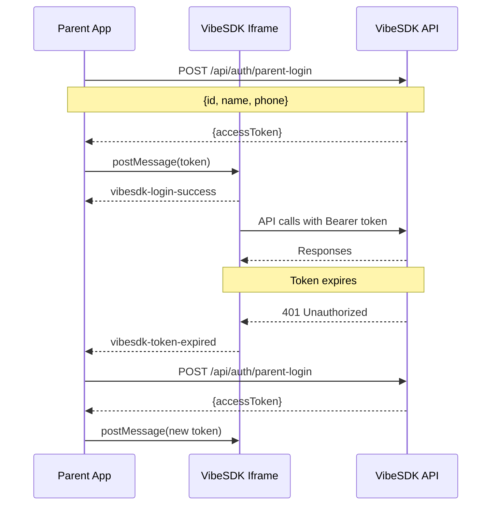

# VibeSDK Iframe Integration Guide

## Overview

This guide explains how to integrate VibeSDK into your application as an iframe using Bearer token authentication via postMessage, completely bypassing third-party cookie restrictions.

## Architecture

The integration uses a simple flow:

1. **Parent App** authenticates the user with VibeSDK backend
2. **Parent App** receives an access token (JWT)
3. **Parent App** sends token to iframe via postMessage
4. **VibeSDK Iframe** uses Bearer token for all API calls
5. **VibeSDK Iframe** sends status messages back to parent



## Step 1: Embed VibeSDK Iframe

```html
<iframe
  id="vibesdk-iframe"
  src="https://vibesdk-nxtwave.web-1c2.workers.dev"
  width="100%"
  height="600"
  frameborder="0"
  allow="clipboard-write; clipboard-read"
></iframe>
```

## Step 2: Authenticate with VibeSDK Backend

Call the parent-login endpoint with user details:

```javascript
async function loginToVibeSDK(userId, userName, userPhone) {
  try {
    const response = await fetch('https://vibesdk-nxtwave.web-1c2.workers.dev/api/auth/parent-login', {
      method: 'POST',
      headers: {
        'Content-Type': 'application/json',
      },
      body: JSON.stringify({
        id: userId,           // Your internal user ID
        name: userName,       // User's display name
        phone: userPhone      // Format: +91XXXXXXXXXX
      })
    });

    if (!response.ok) {
      throw new Error(`Login failed: ${response.status}`);
    }

    const data = await response.json();
    return data.data.accessToken; // or data.accessToken depending on response format
  } catch (error) {
    console.error('VibeSDK login error:', error);
    throw error;
  }
}
```

### Request Format

```typescript
interface ParentLoginRequest {
  id: string;      // Your internal user ID
  name: string;    // User's display name
  phone: string;   // Format: +91XXXXXXXXXX (must start with +91)
}
```

### Response Format

```typescript
interface ParentLoginResponse {
  accessToken: string;   // JWT token
  user: {
    id: string;
    email: string;
    displayName: string;
    // ... other user fields
  };
  sessionId: string;
  expiresAt: string;     // ISO 8601 timestamp
}
```

## Step 3: Send Token to Iframe

Support both message formats for compatibility:

```javascript
const iframe = document.getElementById('vibesdk-iframe');
const accessToken = await loginToVibeSDK(userId, userName, userPhone);

// Store token for refreshes
localStorage.setItem('vibesdk_token', accessToken);

// Wait for iframe to load
iframe.addEventListener('load', () => {
  // Send token to iframe (supports both formats)
  iframe.contentWindow.postMessage({
    type: 'vibesdk-auth',           // New format (recommended)
    token: accessToken,
    origin: window.location.origin
  }, '*');
  
  // Alternative legacy format (also supported):
  // iframe.contentWindow.postMessage({
  //   type: 'VIBESDK_TOKEN',
  //   token: accessToken
  // }, '*');
});
```

## Step 4: Listen for Status Messages

The iframe sends status messages back to the parent:

```javascript
window.addEventListener('message', (event) => {
  // Validate origin in production
  if (event.origin !== 'https://vibesdk-nxtwave.web-1c2.workers.dev') {
    return;
  }

  switch (event.data.type) {
    case 'vibesdk-login-success':
      console.log('VibeSDK authenticated successfully');
      break;

    case 'vibesdk-login-failed':
      console.error('VibeSDK authentication failed');
      // Retry login or show error to user
      handleLoginFailure();
      break;

    case 'vibesdk-token-expired':
      console.log('Token expired, refreshing...');
      // Refresh token and resend to iframe
      refreshToken();
      break;

    case 'vibesdk-error':
      console.error('VibeSDK error:', event.data.message);
      break;
  }
});
```

## Step 5: Implement Token Refresh

Refresh tokens automatically every 20 minutes:

```javascript
const TOKEN_REFRESH_INTERVAL = 20 * 60 * 1000; // 20 minutes

async function refreshToken() {
  try {
    // Get user info from your store
    const { userId, userName, userPhone } = getUserInfo();
    
    // Get new token
    const newToken = await loginToVibeSDK(userId, userName, userPhone);
    
    // Store new token
    localStorage.setItem('vibesdk_token', newToken);
    
    // Send to iframe
    const iframe = document.getElementById('vibesdk-iframe');
    iframe.contentWindow.postMessage({
      type: 'vibesdk-auth',
      token: newToken,
      origin: window.location.origin
    }, '*');
    
    console.log('Token refreshed successfully');
  } catch (error) {
    console.error('Token refresh failed:', error);
  }
}

// Set up automatic refresh
setInterval(refreshToken, TOKEN_REFRESH_INTERVAL);
```

## Complete Example

Here's a complete implementation:

```javascript
class VibSDKIntegration {
  constructor(iframeId, vibeSDKUrl) {
    this.iframe = document.getElementById(iframeId);
    this.vibeSDKUrl = vibeSDKUrl;
    this.token = null;
    this.refreshInterval = null;
    
    this.setupMessageListener();
  }

  async initialize(userId, userName, userPhone) {
    try {
      // Get token from VibeSDK
      this.token = await this.login(userId, userName, userPhone);
      
      // Store for later use
      localStorage.setItem('vibesdk_token', this.token);
      
      // Send to iframe when loaded
      if (this.iframe.contentWindow) {
        this.sendTokenToIframe();
      } else {
        this.iframe.addEventListener('load', () => this.sendTokenToIframe());
      }
      
      // Start automatic refresh
      this.startTokenRefresh(userId, userName, userPhone);
      
      return true;
    } catch (error) {
      console.error('VibeSDK initialization failed:', error);
      return false;
    }
  }

  async login(userId, userName, userPhone) {
    const response = await fetch(`${this.vibeSDKUrl}/api/auth/parent-login`, {
      method: 'POST',
      headers: { 'Content-Type': 'application/json' },
      body: JSON.stringify({ id: userId, name: userName, phone: userPhone })
    });

    if (!response.ok) {
      throw new Error(`Login failed: ${response.status}`);
    }

    const data = await response.json();
    return data.data?.accessToken || data.accessToken;
  }

  sendTokenToIframe() {
    if (!this.token || !this.iframe.contentWindow) return;
    
    this.iframe.contentWindow.postMessage({
      type: 'vibesdk-auth',
      token: this.token,
      origin: window.location.origin
    }, '*');
  }

  setupMessageListener() {
    window.addEventListener('message', (event) => {
      // Validate origin in production
      if (event.origin !== this.vibeSDKUrl) return;

      switch (event.data.type) {
        case 'vibesdk-login-success':
          console.log('VibeSDK authenticated');
          break;

        case 'vibesdk-login-failed':
          console.error('Authentication failed');
          this.handleLoginFailure();
          break;

        case 'vibesdk-token-expired':
          console.log('Token expired, refreshing...');
          this.refreshTokenNow();
          break;

        case 'vibesdk-error':
          console.error('VibeSDK error:', event.data);
          break;
      }
    });
  }

  startTokenRefresh(userId, userName, userPhone) {
    // Refresh every 20 minutes
    this.refreshInterval = setInterval(async () => {
      try {
        this.token = await this.login(userId, userName, userPhone);
        localStorage.setItem('vibesdk_token', this.token);
        this.sendTokenToIframe();
        console.log('Token refreshed');
      } catch (error) {
        console.error('Token refresh failed:', error);
      }
    }, 20 * 60 * 1000);
  }

  async refreshTokenNow() {
    // Implement based on your user data retrieval
    const userData = this.getUserData();
    if (userData) {
      this.token = await this.login(userData.id, userData.name, userData.phone);
      this.sendTokenToIframe();
    }
  }

  destroy() {
    if (this.refreshInterval) {
      clearInterval(this.refreshInterval);
    }
  }
}

// Usage
const vibesdk = new VibSDKIntegration('vibesdk-iframe', 'https://vibesdk-nxtwave.web-1c2.workers.dev');
vibesdk.initialize('user123', 'John Doe', '+919876543210');
```

## Security Considerations

### 1. Origin Validation

Always validate message origins in production:

```javascript
window.addEventListener('message', (event) => {
  const allowedOrigins = [
    'https://vibesdk-nxtwave.web-1c2.workers.dev'
  ];
  
  if (!allowedOrigins.includes(event.origin)) {
    console.warn('Unauthorized origin:', event.origin);
    return;
  }
  
  // Handle message
});
```

### 2. HTTPS Required

Always use HTTPS in production. PostMessage over HTTP is insecure.

### 3. Token Storage

Store tokens securely:

```javascript
// Good: localStorage (iframe can't access parent's localStorage)
localStorage.setItem('vibesdk_token', token);

// Avoid: Cookies (subject to same restrictions)
```

### 4. Phone Number Format

Always validate phone format before sending:

```javascript
function validatePhone(phone) {
  return /^\+91\d{10}$/.test(phone);
}

function formatPhone(phone) {
  // Add +91 if missing
  if (phone.startsWith('91') && phone.length === 12) {
    return `+${phone}`;
  }
  if (phone.length === 10) {
    return `+91${phone}`;
  }
  return phone;
}
```

## Message Types Reference

### Messages from Parent to Iframe

| Type | Description | Payload |
|------|-------------|---------|
| `vibesdk-auth` | Send authentication token | `{ type, token, origin }` |
| `VIBESDK_TOKEN` | Legacy auth format | `{ type, token }` |
| `vibesdk-refresh-token` | Refresh token | `{ type, token }` |
| `vibesdk-token-clear` | Clear token | `{ type }` |

### Messages from Iframe to Parent

| Type | Description | Payload |
|------|-------------|---------|
| `vibesdk-login-success` | Auth successful | `{ type, origin }` |
| `vibesdk-login-failed` | Auth failed | `{ type, message, origin }` |
| `vibesdk-token-expired` | Token expired | `{ type, message, origin }` |
| `vibesdk-error` | General error | `{ type, message, origin }` |

## Troubleshooting

### Token not being accepted

1. Check token format - must be valid JWT
2. Verify token hasn't expired
3. Check network console for 401 errors
4. Verify phone number format (+91XXXXXXXXXX)

### Iframe not loading

1. Check CSP headers allow iframe embedding
2. Verify iframe src URL is correct
3. Check browser console for errors
4. Ensure network connectivity

### PostMessage not working

1. Wait for iframe 'load' event before sending
2. Verify targetOrigin is correct
3. Check browser console for postMessage errors
4. Validate message format

### 401 Errors after some time

1. Implement automatic token refresh
2. Check token expiry time (default 24 hours)
3. Listen for `vibesdk-token-expired` messages
4. Refresh token and resend to iframe

## API Endpoint Details

### POST /api/auth/parent-login

Authenticates a user from the parent application.

**URL:** `https://vibesdk-nxtwave.web-1c2.workers.dev/api/auth/parent-login`

**Method:** `POST`

**Headers:**
```json
{
  "Content-Type": "application/json"
}
```

**Request Body:**
```json
{
  "id": "user_123",
  "name": "John Doe",
  "phone": "+919876543210"
}
```

**Success Response (200):**
```json
{
  "success": true,
  "data": {
    "accessToken": "eyJhbGciOiJIUzI1NiIsInR5cCI6IkpXVCJ9...",
    "user": {
      "id": "usr_abc123",
      "email": "919876543210@parent-app.vibesdk.internal",
      "displayName": "John Doe",
      "provider": "parent",
      "externalId": "user_123",
      "phoneNumber": "+919876543210"
    },
    "sessionId": "ses_xyz789",
    "expiresAt": "2026-02-13T12:00:00.000Z"
  }
}
```

**Error Response (400):**
```json
{
  "success": false,
  "error": {
    "message": "Phone must be in format +91XXXXXXXXXX",
    "type": "VALIDATION_ERROR"
  }
}
```

**Error Response (500):**
```json
{
  "success": false,
  "error": {
    "message": "Failed to create user",
    "type": "SERVER_ERROR"
  }
}
```

## Testing

### Local Development

1. Start VibeSDK:
```bash
npm run dev
```

2. Create test parent page:
```html
<!DOCTYPE html>
<html>
<head><title>VibeSDK Test</title></head>
<body>
  <iframe id="vibesdk" src="http://localhost:5173" width="100%" height="600"></iframe>
  <script>
    async function init() {
      const token = await fetch('http://localhost:8787/api/auth/parent-login', {
        method: 'POST',
        headers: { 'Content-Type': 'application/json' },
        body: JSON.stringify({
          id: 'test123',
          name: 'Test User',
          phone: '+919876543210'
        })
      }).then(r => r.json()).then(d => d.data.accessToken);
      
      document.getElementById('vibesdk').contentWindow.postMessage({
        type: 'vibesdk-auth',
        token
      }, '*');
    }
    
    setTimeout(init, 1000);
  </script>
</body>
</html>
```

### Production Testing

Use the production URL in your test:
```javascript
const VIBESDK_URL = 'https://vibesdk-nxtwave.web-1c2.workers.dev';
```

## Support

For issues or questions:
- Check browser console for errors
- Verify all message formats match specification
- Ensure HTTPS is used in production
- Contact VibeSDK team for integration support
